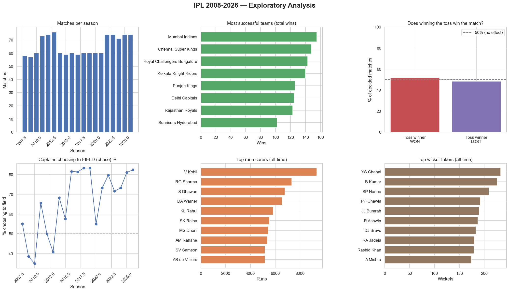
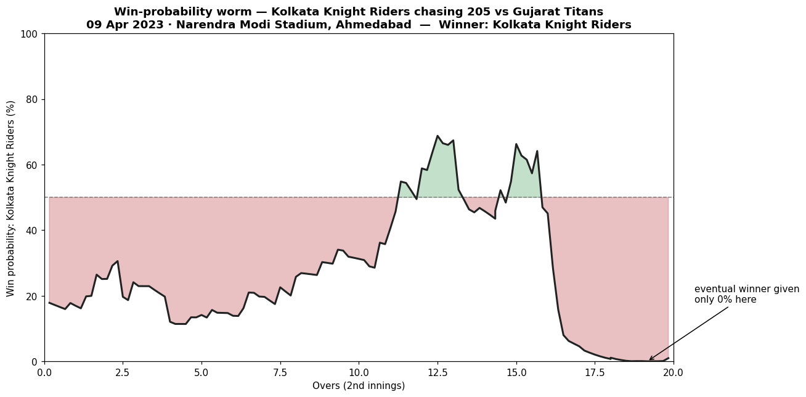

# 🏏 IPL Cricket Analytics & Win Predictor

An end-to-end data science project on **Indian Premier League** cricket — from
raw ball-by-ball data all the way to a deployed, interactive web app that
predicts the live win probability of a match.

> Built as a portfolio project to demonstrate the full data science lifecycle:
> data engineering, exploratory analysis, statistics, machine learning, and
> deployment.

---

## 📌 Project roadmap

This project is built in four phases. Each phase is a self-contained, runnable
lesson that adds a new skill.

- [x] **Phase 1 — Data engineering (ETL).** Turn ~1,240 raw Cricsheet match
      files into two clean, analysis-ready tables. → `lesson1_build_dataset.py`
- [x] **Phase 2 — Exploratory data analysis.** Clean franchise names and answer
      real questions with charts: toss impact, top scorers, chasing trends.
      → `lesson2_eda.py`
- [x] **Phase 3 — Machine learning.** Predict the ball-by-ball **win
      probability** of a chasing team (logistic regression, ROC-AUC 0.875).
      → `lesson4_features.py`, `lesson5_train.py`, `lesson6_worm.py`
- [x] **Phase 4 — Deployment.** A multi-page **Streamlit** analytics platform —
      league dashboard, team deep-dive, player analytics, batter-vs-bowler
      battles, head-to-head, and the live win predictor.
      → `app.py` (`streamlit run app.py`)

## 🧰 Tech stack

`Python` · `pandas` · `numpy` · `matplotlib` / `seaborn` · `scikit-learn` ·
`scipy` · `Streamlit` (Phase 4)

## 🗂️ Data

Ball-by-ball IPL data from **[Cricsheet](https://cricsheet.org)** — free,
high-quality, and updated each season. Two files per match:

| File | Grain | Contents |
|------|-------|----------|
| `<id>.csv` | one row per ball | over, batter, bowler, runs, wicket… |
| `<id>_info.csv` | key/value | teams, venue, toss, result, player of the match |

We transform these into:

| Output | Grain | Rows |
|--------|-------|------|
| `data/deliveries.csv` | one row per ball | ~260,000 |
| `data/matches.csv` | one row per match | ~1,240 |

## 🖥️ The analytics platform (`app.py`)

A six-page interactive web app — dark "futuristic" theme, Plotly charts:

| Page | What it does |
|------|--------------|
| 🛰️ Command Center | League KPIs, scoring inflation, top franchises, the rise of chasing |
| 🔬 Team Deep Dive | Any franchise: win-rate by season, top players, record vs every opponent, fortress venues |
| 👤 Player Analytics | Any batter: career stats, acceleration curve, "Scoring DNA", auto-detected strong/weak phases & nemesis bowlers |
| 🥊 Player Battles | Batter-vs-bowler matchups (e.g. Kohli vs Bumrah): balls, runs, SR, dismissals, season-by-season |
| ⚔️ Head to Head | Any two franchises, all-time |
| 🎯 Win Predictor | The ML model as a live win-probability gauge + what-if curve |

> *Note on wagon wheels:* true shot-placement charts need ball-tracking
> (Hawk-Eye) data, which isn't in the free Cricsheet feed. Rather than fake it,
> Player Analytics uses an honest run-type "Scoring DNA" breakdown.

## 📊 Sample output

**Phase 2 — exploratory dashboard:**



*Six questions answered from ~295k deliveries: league growth, the most successful
franchises, the (near-zero) toss advantage, the rise of chasing, and the all-time
run & wicket leaders.*

**Phase 3 — live win-probability worm.** The model auto-selected the most dramatic
match it had never seen: KKR's miracle chase vs GT (Rinku Singh's 5 sixes, 2023).
It correctly gave KKR ~0% before the final over:



## 🚀 How to run

```bash
# 1. (optional but recommended) create an isolated environment
python -m venv .venv && source .venv/bin/activate

# 2. install dependencies
python -m pip install -r requirements.txt

# 3. download the raw data
python download_data.py

# 4. build the clean tables
python lesson1_build_dataset.py

# 5. (after running lessons 4-6 to train the model) launch the web app
streamlit run app.py
```

## 🌐 Deploy your own (free)

The app is ready for **[Streamlit Community Cloud](https://share.streamlit.io)**:

1. Push this folder to a **public GitHub repo**.
2. On Streamlit Community Cloud → *New app* → point it at `app.py`.
3. It installs `requirements.txt` and gives you a **public URL** to put on your CV.

The deployed app only needs `app.py`, `winprob.py`, `cricket_utils.py`, the saved
`model/`, and `requirements.txt` — no data files required. *(If the cloud build
errors loading the model, pin `scikit-learn` in `requirements.txt` to your local
version — check it with `pip show scikit-learn`.)*

## 📁 Repository structure

```
ipl-analytics/
├── README.md
├── requirements.txt
├── cricket_utils.py            # shared helpers: team cleaning + data loaders
├── download_data.py            # Step 1: fetch raw data from Cricsheet
├── lesson1_build_dataset.py    # Phase 1: ETL -> clean tables
├── lesson2_eda.py              # Phase 2: exploratory analysis -> dashboard
├── lesson3_stats.py            # Phase 2: hypothesis testing (toss & chasing)
├── lesson4_features.py         # Phase 3: feature engineering -> training table
├── lesson5_train.py            # Phase 3: train + evaluate the win-prob model
├── lesson6_worm.py             # Phase 3: gradient boosting + win-prob worm
├── ui.py                       # app: futuristic dark design system
├── analytics.py                # app: cached league/team/player/battle analytics
├── views.py                    # app: the six pages
├── winprob.py                  # app: model-serving helpers
├── app.py                      # app: Streamlit entry point + navigation
├── model/                      # saved trained model (.joblib)
├── figures/                    # generated charts
└── data/
    ├── raw/                    # raw Cricsheet files (git-ignored)
    ├── matches.csv             # generated
    ├── deliveries.parquet      # generated (compact, used by the app)
    └── deliveries.csv          # generated (git-ignored, large)
```

## 🙏 Credits

- Data: **[Cricsheet](https://cricsheet.org)** by Stephen Rushe.
- Author: **Paras Jangir**
